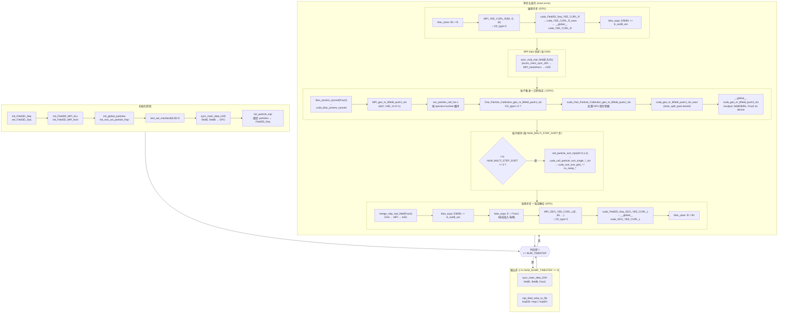
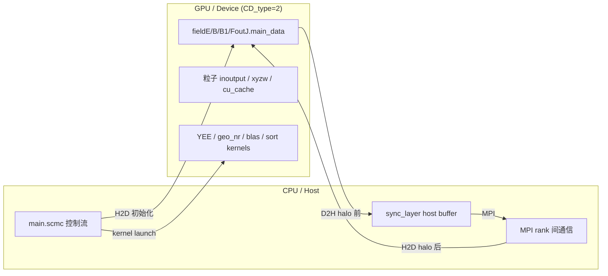

# 拆大kernerl
_Exported on 5/21/2026 at 09:39:51 EDT from Cursor (3.4.20)_

---

**User**

这个图片是mpi 版本代码的计算流程。 现在类似的 写一个cuda版本的。流程图

---

**Cursor**

对照 MPI 流程图，我先在代码库里梳理 CUDA 版本的初始化、主时间步和内核调用链。


根据代码库（主要是 `main.scmc` 主时间步循环），CUDA 版本与 MPI 图在**高层逻辑上相同**，差异在于：计算在 GPU 上执行，MPI 仍负责域分解与 halo 交换，且 halo 同步前后需要 **D2H / H2D**。

---

## CUDA 版计算流程图



---

## 与 MPI 流程图的对应关系

| MPI 图（你提供的） | CUDA 版等价实现 |
|---|---|
| `openmp_geo_nr_Bfield_pushJ_via_sum` | `cuda_One_Particle_Collection_geo_nr_Bfield_pushJ_vlo` |
| `__global__ mapu_geo_nr_Bfield_pushJ_via` | `__global__ cuda_geo_nr_Bfield_pushJ_vlo`（`cuda_/inner_split_pass.kernel.cu`） |
| `MPI_YEE_CURL_R` | 同名 MPI 包装，内部按 `CD_type=2` 调 `cuda_Field3D_Seq_YEE_CURL_R` |
| `sync_ovlp_mpi_field` | 保留；同步前 `pscmc_mem_sync_d2h`，收完后回 GPU |
| `sync_main_data_H2D` | 初始化后 `init_particle.scmc` 中 `sync_main_data_h2d` |
| `i % 4 == 3` 排序 | `t % NUM_MULTI_STEP_SORT == 0`（cyclone 默认 `NUM_MULTI_STEP_SORT=4`） |
| `bias_y2zero_synced` / `bias_axpy` | `blas_yiszero_synced` / `blas_axpy`（`cuda_/miniblas`） |

主时间步在 scheme 中的位置：

```223:254:main.scmc
	  ;;;;here comes the main iteration step (cyclone: USE_TORI=1, USE_VLO=1)
	  (comment "set B1=B")
	  (blas_yisax_Field3D_MPI ("&" ppis->MPI_fieldB1) ("&" ppis->MPI_fieldB1) 1.0 ("&" ppis->MPI_fieldB))
	  (MPI_YEE_CURL_R ("&" ppis->MPI_fieldB1) ("&" ppis->MPI_fieldE) DELTAT)
	  ...
	  (MPI_geo_nr_Bfield_pushJ_vlo ppis pMPI_fieldE pMPI_fieldB ("&" MPI_fieldB1) pMPI_FoutJ pmass pchg (* 0.5 DELTAT) T_TORI_X0 0 0 0 0 0))
	  ...
	  (if (eq? (remainder t num_multi_step_sort) 0)
	    (begin
	      (call_particle_sort_mpi ppis 0 0)
	      ...
	  (merge_ovlp_mpi_field ("&" ppis->MPI_FoutJ))
	  ...
	  (MPI_GEO_YEE_CURL_L ("&" ppis->MPI_fieldE) ("&" ppis->MPI_fieldB1) T_TORI_X0 M_DELTA_X M_DELTA_Y M_DELTA_Z DELTAT)
```

粒子推进的 CUDA 分发：

```58273:58288:run_particle_call_fun.c
	if (  	(  0 == CD_type )
  ){  
			c_One_Particle_Collection_geo_nr_Bfield_pushJ_vlo ( ... )
	}else{
			if (  	(  1 == CD_type )
  ){  
			openmp_One_Particle_Collection_geo_nr_Bfield_pushJ_vlo ( ... )
	}else{
			if (  	(  2 == CD_type )
  ){  
			cuda_One_Particle_Collection_geo_nr_Bfield_pushJ_vlo ( ... )
```

---

## CUDA 架构要点（与 MPI 图的区别）



1. **仍是 MPI+CUDA 混合**：`PS_MPI_Init`、域分解、`sync_ovlp_mpi_field` 不变；单卡多 rank 时每个 rank 对应一块 GPU（`GET_DEV_TYPE` / `GET_DEV_ID`）。
2. **场与粒子数据常驻 GPU**：`field*.main_data`、`inoutput` 等在 device；只有 halo、I/O 走 D2H/H2D。
3. **运行时三分发**：`CD_type`：0=C、1=OpenMP、2=CUDA；cyclone 算例通过 `GET_DEV_TYPE` 设为 2。
4. **物理公式不变**：`cuda_geo_nr_Bfield_pushJ_vlo` 与 MPI 图中 `GEN65_0` / `mapu_*` 为同一套 scheme 生成逻辑，只是执行设备从 CPU 线程变为 CUDA block/thread。

---

## 底层 kernel 调用栈（粒子支，对应你图左侧）

```
main.scmc
  └─ MPI_geo_nr_Bfield_pushJ_vlo          [MPI 层：遍历 species]
       └─ One_Particle_Collection_geo_nr_Bfield_pushJ_vlo
            └─ (CD_type==2) cuda_One_Particle_Collection_geo_nr_Bfield_pushJ_vlo
                 └─ cuda_geo_nr_Bfield_pushJ_vlo_exec    [runtime wrapper]
                      └─ __global__ cuda_geo_nr_Bfield_pushJ_vlo
                           (geo 坐标 + V×B 推进 + 电流沉积到 FoutJ)
```

场求解 kernel 栈：

```
MPI_YEE_CURL_R / MPI_GEO_YEE_CURL_L
  └─ cuda_Field3D_Seq_* 
       └─ cuda_YEE_CURL_R_exec / cuda_GEO_YEE_CURL_L_exec
            └─ __global__ cuda_YEE_CURL_R / cuda_GEO_YEE_CURL_L
                 (geo_yeefdtd.kernel.cu)
```

---

如果你需要**完全单 GPU、无 MPI** 的流程图，需要改 `NUM_PROCESS` 和 halo 路径；当前 `trim_murABC_2` / cyclone 仍是 **MPI 域分解 + per-rank CUDA**。需要我按 `run_gpu.sh` 里的 rank/GPU 配置再画一版「多卡 MPI-CUDA」示意图，可以说一下进程数和 GPU 数。

---

**User**

@\teamspace\studios\this_studio\.cursor\projects\teamspace-studios-this-studio-symPIC\terminals\1.txt:294-310 我现在想把耗时最多的这个kernel  按照功能 安装 执行的顺序 拆分（功能可以参照图片）。 部分1，setup 和赋值 5x5x5x3， 2. 计算插值权重 f0 f1  3. 我不确定，猜测可能是执行插值过程。 4. 计算 if0 if1 插值权重的积分。 5. 电流沉积。  参照代码回答我，这个kernel 中 对应的5步分别应该是什么？

---

**Cursor**

下面对照 `cuda_/inner_split_pass.kernel.cu` 中 `cuda_geo_nr_Bfield_pushJ_vlo`（line 62435–72009，共 ~9600 行）逐段拆解，正好对应你手稿里的 5 步：

## Kernel 五阶段拆解（按执行顺序）

### Stage 1 — Setup + 共享内存加载 5×5×5×3（line 62435 – 62897）

申明索引、几何常量、申明 4 块 shared memory，再把 fieldE/B/B1/FoutJ 的 5×5×5×3 子块从全局拷到共享内存。

```62513:62518:cuda_/inner_split_pass.kernel.cu
	__shared__ double   shE0  [375];
	__shared__ double   shB0  [375];
	__shared__ double   shB1  [375];
	__shared__ double   shJ0  [375];
	__shared__ double   Jtmp_shd  [	(  IDX_LOCAL_XLEN / 32 )
];
```

- `5×5×5×3 = 375`，对应你手稿"5²[3,2,5]"
- 由 `for xyzz=0..5 / xyzy=0..5 / xyzx=0..1` 三重循环填 `shE0, shB0, shB1, shJ0`（line 62667–62894）
- 段末 `__syncthreads()` at line 62897

### Stage 2 — 计算插值权重 f0, f1, if1（在 x0、x1）（line 62897 – 64138）

先从 `cu_cache` 取粒子 `xx1, xy1, xz1, vx0, vy0, vz0`，并反推上一时刻位置 `xx0 = xx1 − Δt·vx0`：

```62942:62979:cuda_/inner_split_pass.kernel.cu
	double  xx1 = (local_particle_head)[0] ;
	...
	double  vx0 = (local_particle_head)[3] ;
	...
	double  xx0 = 	(  xx1 - 	(  Deltat * vx0 )
 )
 ;
```

然后计算 **x0 处**的 9 组权重和 **x1 处**的 9 组权重：

| 行号 | 数组 | 含义 |
|---|---|---|
| 63035 / 63112 / 63159 | `f0_x0[5] / f1_x0[5] / if1_x0[5]` | x 方向插值权重和积分，**at x0** |
| 63219 / … / 63343 | `f0_y0 / f1_y0 / if1_y0` | y 方向，at x0 |
| 63403 / … / 63527 | `f0_z0 / f1_z0 / if1_z0` | z 方向，at x0 |
| 63587 / 63664 / 63711 | `f0_x1 / f1_x1 / if1_x1` | x 方向，**at x1** |
| 63771 / … / 63895 | `f0_y1 / f1_y1 / if1_y1` | y 方向，at x1 |
| 63955 / … / 64079 | `f0_z1 / f1_z1 / if1_z1` | z 方向，at x1 |

`f0` 是基函数值，`f1` 是其一阶矩，`if1` 是积分（手稿里的 if0/if1）。

### Stage 3 — 场插值 + Verlet 推进得到 x2 / x3（line 64139 – 66176，与 Stage 4 交错）

#### 3a) 用 x1 处的权重对 shE0、shB0 做 5×5×4 插值得到 `AllEx/AllEy/AllEz`：

```64166:64200:cuda_/inner_split_pass.kernel.cu
(AllEx = 	(  AllEx + 	(  	(  (shE0)[	(  0 + 	(  3 * 	(  idx + 	(  5 * 	(  idy + 	(  idz * 5 )
...
 * 	(  (f1_x1)[idx] * 	(  (f0_y1)[idy] * (f0_z1)[idz] )
```

— **正是你猜的"执行插值过程"**。

#### 3b) 计算 v×B 修正 `iBx/iBy/iBz`，再用对称化（Verlet 风格）推进位置：

```64258:64273:cuda_/inner_split_pass.kernel.cu
	double  x2 = 	(  	(  	(  -1.00000000000000000e+00 * x0 )
 + 	(  2.00000000000000000e+00 * x1 )
 )
 + 	(  	(  1.00000000000000000e+00 / ({
	double  tmppowvar = DELTA_X ;
	(  tmppowvar * tmppowvar )
;
}) )
 * 	(  QE_MASS * 	(  Deltat * 	(  allincfvx + 	(  -1.00000000000000000e+00 * iBx )
 )
 )
 )
 )
 )
 ;
```

即 `x2 = −x0 + 2·x1 + (Q/M)·Δt·(allincfv − iB) / Δx²`。

> 注意：这里 x、y、z 三个方向的"推进 → 立即算权重"是**交错**进行的：算完 `x2/rx2/dixx2` 立刻算 `f0_x2/f1_x2/if1_x2`，再做 y 方向插值/推进/权重，再做 z 方向…… 最后还会得到 x3/y3/z3（geo-symplectic 中分裂为 4 个子位置 x0,x1,x2,x3）。

### Stage 4 — 计算 x2 / x3 的 f0、f1、if0、if1（line 64286 – 66301，与 Stage 3 交错）

| 行号 | 数组 |
|---|---|
| 64286 / 64363 / 64410 | `f0_x2 / f1_x2 / if1_x2` |
| 64694 / 64818 | `f0_y2 / if1_y2` |
| 65099 / 65223 | `f0_z2 / if1_z2` |
| 65314 / 65438 | `f0_z3 / if1_z3` |
| 65652 / 65776 | `f0_y3 / if1_y3` |
| 66177 / 66254 / 66301 | `f0_x3 / f1_x3 / if1_x3` |

— 对应你手稿 (4) `x2,x3, if0, if1`。

### Stage 5 — 电流沉积 J → shJ0 → FoutJ（line 66400 – 67241）

#### 5a) 用 (if1_y2 − if1_y1)、(if1_z2 − if1_z1) 等差分构造 Jx/Jy/Jz：

```66537:66541:cuda_/inner_split_pass.kernel.cu
(Jtmp = 	(  simd_mask * 	(  	(  (if1_y2)[xyzy] - (if1_y1)[xyzy] )
 * 	(  (f0_x2)[xyzx] * (f0_z1)[xyzz] )
 )
 )
);
```

`Δif1` × `f0 × f0` 的结构正是 charge-conserving 电流沉积（类 Esirkepov 算法）：用积分权重的**差分**得到电流密度。

#### 5b) 在 warp 内做归约（`__shfl_down_sync`）并加几何因子写回 `shJ0`：

```66481:66493:cuda_/inner_split_pass.kernel.cu
((shJ0)[	(  	(  allidx * 3 )
 + 0 )
] = 	(  (shJ0)[	(  	(  allidx * 3 )
 + 0 )
] + 	(  	(  grid_geo_x * 	(  	(  Tori_X0 / 	(  Tori_X0 + 	(  XO + 	(  bBidx + xyzx )
 )
 )
 )
 * Charge0 )
 )
 * Jtmp )
 )
);
```

#### 5c) 写回 cu_cache（更新后的粒子位置/速度）：line 67130–67149

#### 5d) `__syncthreads()` + 把 shJ0 写回全局 FoutJ：line 67161–67241

```67202:67230:cuda_/inner_split_pass.kernel.cu
		((	(  FoutJ + 	(  	(  num_ele * 	(  __idy * 	(  	(  XLEN + 	(  2 * ovlp )
...
)[ridx] = (	(  shJ0 + total_idx )
)[ridx]);
```

---

## 总结对照表

| 手稿步骤 | 功能 | 行范围 | 关键变量 |
|---|---|---|---|
| **① 大 → 5²[3,2,5], fo** | Setup + 5×5×5×3 共享内存装入 | 62435–62897 | `shE0/shB0/shB1/shJ0[375]` |
| **② fo, fl** | 计算 x0/x1 处插值权重 | 62897–64138 | `f0_x0/y0/z0, f1_*, if1_*; f0_x1/y1/z1, …` |
| **③ x0,x1 → x2,x3** | 场插值 + Verlet/v×B 推进 | 64139–66176（与 ④ 交错） | `AllE*, AllB*, iBx/y/z, allincfv*, x2/y2/z2/x3/y3/z3` |
| **④ x2,x3, if0, if1** | 新位置处插值/积分权重 | 64286–66301（与 ③ 交错） | `f0_x2/y2/z2, if1_x2/y2/z2, f0_x3/…, if1_*3` |
| **⑤ depo** | 电流沉积 + warp 归约 + 写回 FoutJ | 66400–67241 | `Jtmp = Δif1·f0·f0`，`shJ0 → FoutJ`，`cu_cache` 写回 |

---

## 关于性能拆分的建议

`cuda_geo_nr_Bfield_pushJ_vlo` 占了 91.2% GPU 时间、平均每次调用 ~3 秒——这是**唯一**的热点 kernel。如果想拆分成更小的内核以做 profile / 优化，建议的**自然切分线**：

1. **K1 = Stage 1**（load shared memory）— 几乎纯访存，可以单独看 L1/L2 命中
2. **K2 = Stage 2 + Stage 3**（权重 + 插值 + push）— 浮点密集，无 shJ0 写依赖
3. **K3 = Stage 4 + Stage 5**（新权重 + 沉积）— 关键依赖 warp shuffle 归约 + shared atomic-free 累加
4. **K4 = Stage 5 后半**（shJ0 → FoutJ 写回）— 纯访存

不过我注意到 Stage 3 和 Stage 4 在源码层面**完全交错**（每个方向算完 x2 立刻算 f0_x2/if1_x2 再算 y2…），如果硬拆 K2/K3 会需要把 x2、rx2、dixx2 等中间状态序列化到寄存器或 shared，可能反而变慢。可以先拆 K1（load）、K_main（核心）、K4（store back）三步看看 nsys 占比。

需要我进一步：(a) 估算 Stage 1/5 的访存量；(b) 看看是否能把 Stage 1 改成 cooperative copy / `cp.async`；(c) 定位是 Stage 3 还是 Stage 4 真正占了大头（可以临时注释 Stage 5 看 elapsed 变化）—— 直接说哪个方向继续就行。

---

**User**

我要拆分这个 大的kernel 目标是 拆成小核函数 方便我做 单元测试。 不要做任何的性能优化。要求用经可能简单和保守的方式进行拆分。最好是，进入大核后，安装串行进行。前一kernel的输出 对应到下一个的输入。 如果 Stage 3 和 Stage 4 在源码层面完全交错， 就不要拆！！ 要求最简单的方式拆，保证通过回归测试。 

---

**Cursor**

我先看看相关的源文件（scheme 模板 + 当前 `.cu` 结构），再问关键决策点。

我已经看了 [kernels/inner_split_pass.kernel_.scmc](kernels/inner_split_pass.kernel_.scmc) 和 [inner_split_pass_kernel_macro.scmc](inner_split_pass_kernel_macro.scmc)，确认这个 kernel 完全由 scheme 生成（在 `inner_split_pass_kernel_macro.scmc` 第 316-707 行的 `gencore_fun` lambda 体），共 5 个阶段都在一个 lambda 里串行生成。

按 workspace rule，我应该在 scheme 层拆分，但拆分粒度和形态有几种合理选择，需要你拍板再开始计划。

在动手之前有两个关键决策点必须确认：

> **拆分应该在哪一层做？(workspace rule 倾向 scheme，但你可能有其他考虑)**
> - Scheme 源层：在 inner_split_pass_kernel_macro.scmc 里把 gencore_fun 拆成几段 device 函数，再额外生成几个独立的 __global__ 测试 kernel。原大 kernel 保留不变（保证回归）。
> - Scheme 源层：把原大 kernel 直接改成由几个串行的子 __global__ 替代（host 端串行 launch），主流程也跟着改成调用多个子 kernel。
> - 直接改生成的 .cu 文件，先快速做出来不管 scheme（注意：下次 make 会被覆盖；违反 workspace rule，但最快）。 ✔

> **拆成几个子 kernel？（Stage 3+4 强制不拆，前一个的输出 = 下一个的输入）**
> - 3 个子 kernel：K1=(Stage1+2: setup+载入 shared mem+算 x0/x1 权重)，K2=(Stage3+4: 场插值+push 到 x2/x3+算 x2/x3 权重)，K3=(Stage5: 沉积 J + 写回 FoutJ)。中间 K1→K2 需把 6 组 f0/f1/if1[5]×{x0,x1,y0,y1,z0,z1} 共 18 个数组+shared 4 块写到全局；K2→K3 需把 12 组 x2/x3 权重+新位置写到全局。 ✔
> - 2 个子 kernel：K1=(Stage1+2)，K2=(Stage3+4+5)。中间只需把 18 个 x0/x1 权重数组 + shared 4 块的状态写出。最简单，但 Stage 5 还是和 push 在同一个 kernel 里。
> - 4 个子 kernel：K1=Stage1(只载入 shared)，K2=Stage2(算 x0/x1 权重)，K3=Stage3+4，K4=Stage5。最细，但 K1→K2 还要把 4 块 shared(各 375 doubles) 暴露到全局。

我需要先确认几个关键的辅助信息：(a) 调用 kernel 的 host-side 函数是否也是自动生成的；(b) 看一下 Makefile 的编译逻辑；(c) 看一下 stage 边界的具体行号是否有干净的切点。

我已经把所需信息收集齐全。现在 [cuda_/RUNTIME_SPEC.mk](cuda_/RUNTIME_SPEC.mk) 显示用 `nvcc -arch=sm_75` 编译 host 端，调用点只在 [run_particle_call_fun.c](run_particle_call_fun.c) 的 40010 行一处。

关键边界（基于 [cuda_/inner_split_pass.kernel.cu](cuda_/inner_split_pass.kernel.cu)）：
- 62435–62897：boilerplate + shared-mem 加载（per-block, Stage 1）
- 62897–64138：粒子 `g_inner` 循环里算 x0/x1 权重（Stage 2）
- 64139–66360：场插值→push→x2/x3 权重（Stage 3+4，**完全交错**）
- 66361–67129：5 次 `gen_push_J_proc` 沉积 + Stage 4 末尾的 newxx/newxy/newvz 计算（Stage 5a，**与 push 末尾在源码同一块**）
- 67130–67157：写回 cu_cache
- 67159–67241：shJ0 → FoutJ 写回（Stage 5b）

注意：原图 Stage 4 末尾的 `newxx/newxy/.../newvx/...` 计算（67096–67129）和 Stage 5a 的 5 次 `gen_push_J_proc` 在同一 g_inner 循环体内出现，且 `gen_push_J_proc` 用到的所有 if1_*/f0_*（包括 if1_x2 在 push_J_proc 第 1 步就要、if1_y2 第 2 步要…）必须等到 Stage 4 全部 weight 算完才可用。所以源码层 **Stage 4 与 Stage 5a 也并未明显界限**——但 Stage 5a 仅消费 Stage 4 的输出，并不交错产出新数据，可以干净切。

